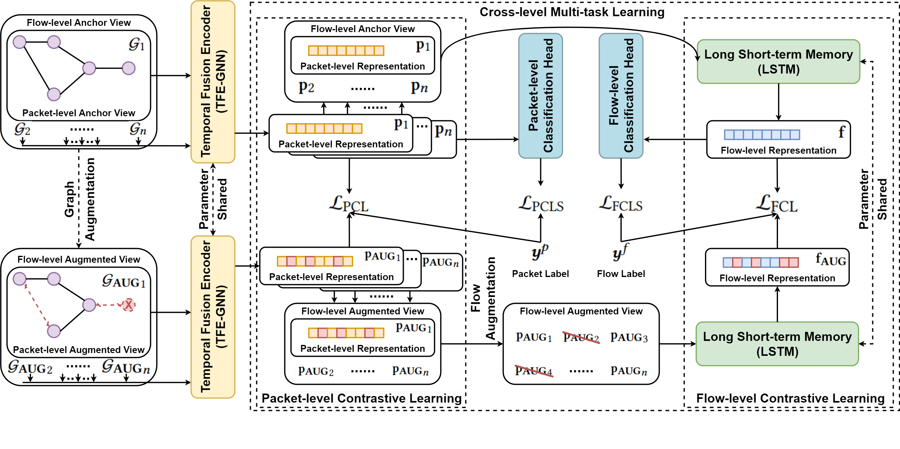
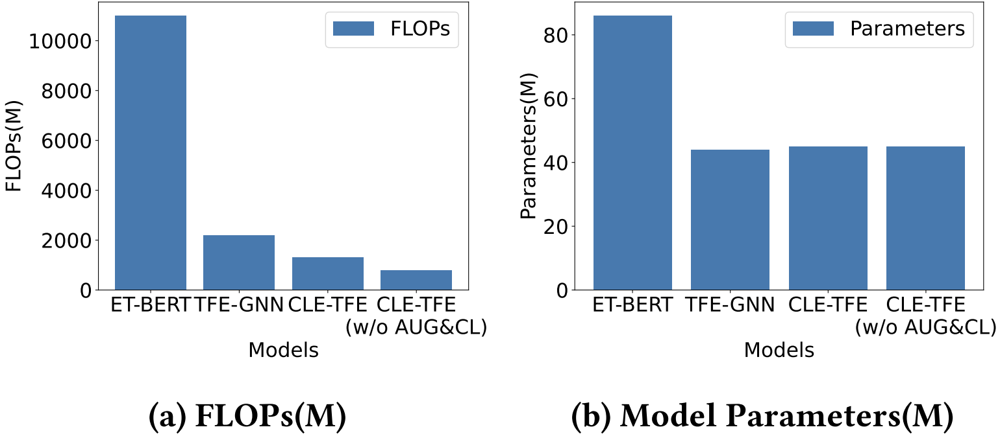

# CLE-TFE


Official implementation of paper: One Train for Two Tasks: An Encrypted Traffic Classification Framework Using Supervised Contrastive Learning. [[arXiv](https://arxiv.org/abs/2402.07501)]




**CLE-TFE is an improved version of [TFE-GNN](https://github.com/ViktorAxelsen/TFE-GNN), which requires only a few modifications to achieve better performance while significantly reducing computational overhead. Moreover, CLE-TFE only needs to be trained once to conduct flow classification and packet classification tasks at the same time.**

## Performance Preview

🚀 The following table shows the comparison of the performance of [TFE-GNN](https://github.com/ViktorAxelsen/TFE-GNN) and CLE-TFE on flow classification tasks. 

**Flow-level Task (ISCX-VPN)**
| Model | AC | PR | RC | F1 |
| -------- | -------- | -------- | -------- | -------- |
| TFE-GNN | 0.9591 | 0.9526 | 0.9593 | 0.9536 |
| **CLE-TFE** | **0.9813** | **0.9771** | **0.9762** | **0.9761** |

**Flow-level Task (ISCX-NonVPN)**
| Model | AC | PR | RC | F1 |
| -------- | -------- | -------- | -------- | -------- |
| TFE-GNN | 0.9040 | 0.9316 | 0.9190 | 0.9240 |
| **CLE-TFE** | **0.9286** | **0.9396** | **0.9391** | **0.9389** |

**Flow-level Task (ISCX-TOR)**
| Model | AC | PR | RC | F1 |
| -------- | -------- | -------- | -------- | -------- |
| TFE-GNN | 0.9886 | 0.9792 | 0.9939 | 0.9855 |
| **CLE-TFE** | **1.0000** | **1.0000** | **1.0000** | **1.0000** |

**Flow-level Task (ISCX-NonTOR)**
| Model | AC | PR | RC | F1 |
| -------- | -------- | -------- | -------- | -------- |
| TFE-GNN | 0.9390 | 0.8742 | 0.8335 | 0.8507 |
| **CLE-TFE** | **0.9554** | **0.9009** | **0.9019** | **0.8994** |

🚀 The following figure shows the comparison of FLOPs and model parameters of ET-BERT, [TFE-GNN](https://github.com/ViktorAxelsen/TFE-GNN), and CLE-TFE.




For more details, please see [[arXiv](https://arxiv.org/abs/2402.07501)].


## Environment Setup

```bash
# python==3.8
pip install torch==1.10.1+cu113 torchvision==0.11.2+cu113 torchaudio==0.10.1 -f https://download.pytorch.org/whl/cu113/torch_stable.html
pip install dgl==1.0.0+cu113 -f https://data.dgl.ai/wheels/cu113/repo.html
pip install scikit-learn
pip install scapy
```


## Pre-processing

**The pre-processing of CLE-TFE and [TFE-GNN](https://github.com/ViktorAxelsen/TFE-GNN) is exactly the same. You can optionally skip the pre-processing section**.

### Download Datasets

[ISCXVPN2016](https://www.unb.ca/cic/datasets/vpn.html) & [ISCXTOR2016](https://www.unb.ca/cic/datasets/tor.html)


Or you can also prepare your own datasets.


### Obtain Bidirectional Flows


We use [SplitCap](https://www.netresec.com/?page=SplitCap) to obtain bidirectional flows for ISCX-VPN, ISCX-NonVPN, ISCX-TOR, and ISCX-NonTOR datasets, respectively. Please refer to it.

You may encounter some pcap file format conversion problems, and we just provide a simple script **pcapng2pcap.py** to convert .pcapng to .pcap files.


**Note**: We only use TCP pcap files in our work.


### Categorization Details

For specific categorization of each dataset, please refer to folder **CATE**.


### Convert .pcap to .npz Files

To facilitate subsequent processing, we extract the information of the .pcap file into the .npz file. 

You may refer to **config.py** and customize your own .pcap path in **DIR_PATH_DICT**. Then, run the following commands to start converting. 

```bash
# ISCX-VPN
python pcap2npy.py --dataset iscx-vpn
# ISCX-NonVPN
python pcap2npy.py --dataset iscx-nonvpn
# ISCX-TOR
python pcap2npy.py --dataset iscx-tor
# ISCX-NonTOR
python pcap2npy.py --dataset iscx-nontor
```


### Construct Byte-level Traffic Graphs

Before start constructing, you may refer to **config.py** and customize all your own file paths. Then, run the following commands to start constructing.

```bash
# ISCX-VPN
python preprocess.py --dataset iscx-vpn
# ISCX-NonVPN
python preprocess.py --dataset iscx-nonvpn
# ISCX-TOR
python preprocess.py --dataset iscx-tor
# ISCX-NonTOR
python preprocess.py --dataset iscx-nontor
```

This script will save the byte-level traffic graph of the specified dataset in the path you specify.


## Training

After pre-processing, run the following commands to start training.

```bash
# ISCX-VPN
CUDA_VISIBLE_DEVICES="0" python train_new.py --dataset iscx-vpn --prefix exp_train --coe 0.5 --coe_graph 1.0 --seq_aug_ratio 0.6 --drop_edge_ratio 0.05 --drop_node_ratio 0.1 --K 15 --hp_ratio 0.5 --tau 0.07 --gtau 0.07
# ISCX-NonVPN
CUDA_VISIBLE_DEVICES="0" python train_new.py --dataset iscx-nonvpn --prefix exp_train --coe 0.8 --coe_graph 0.4 --seq_aug_ratio 0.6 --drop_edge_ratio 0.05 --drop_node_ratio 0.1 --K 15 --hp_ratio 0.5 --tau 0.07 --gtau 0.07
# ISCX-TOR
CUDA_VISIBLE_DEVICES="0" python train_new.py --dataset iscx-tor --prefix exp_train --coe 1.0 --coe_graph 0.4 --seq_aug_ratio 0.6 --drop_edge_ratio 0.05 --drop_node_ratio 0.1 --K 15 --hp_ratio 0.5 --tau 0.07 --gtau 0.07
# ISCX-NonTOR
CUDA_VISIBLE_DEVICES="0" python train_new.py --dataset iscx-nontor --prefix exp_train --coe 1.0 --coe_graph 0.6 --seq_aug_ratio 0.6 --drop_edge_ratio 0.05 --drop_node_ratio 0.1 --K 15 --hp_ratio 0.5 --tau 0.07 --gtau 0.07
```


## Evaluation

After training, run the following commands to start evaluation.

```bash
# ISCX-VPN
CUDA_VISIBLE_DEVICES="0" python test_new.py --dataset iscx-vpn --prefix exp_train
# ISCX-NonVPN
CUDA_VISIBLE_DEVICES="0" python test_new.py --dataset iscx-nonvpn --prefix exp_train
# ISCX-TOR
CUDA_VISIBLE_DEVICES="0" python test_new.py --dataset iscx-tor --prefix exp_train
# ISCX-NonTOR
CUDA_VISIBLE_DEVICES="0" python test_new.py --dataset iscx-nontor --prefix exp_train
```


## Potential Bugs

- **remove() function in utils.py**

  + The location of the header in the packet may change, so check this when using other datasets.


## Note

There are some reasons for possible differences in reproduction results.

- System Environments. (including GPU driver version, etc.) (Verified)

- Data Partition.

  + Since most of the current network traffic datasets do not have a unified way to partition the training dataset and test dataset, this may lead to differences in results, which is normal.

In addition to potential differences, we recommend adjusting the hyperparameters in your data and environment configuration to achieve optimal results. 


## Citation

```bibtex
@article{CLE-TFE,
  title={One Train for Two Tasks: An Encrypted Traffic Classification Framework Using Supervised Contrastive Learning},
  author={Haozhen Zhang and Xi Xiao* and Le Yu and Qing Li and Zhen Ling and Ye Zhang},
  journal={arXiv preprint arXiv:2402.07501},
  year={2024}
}
```